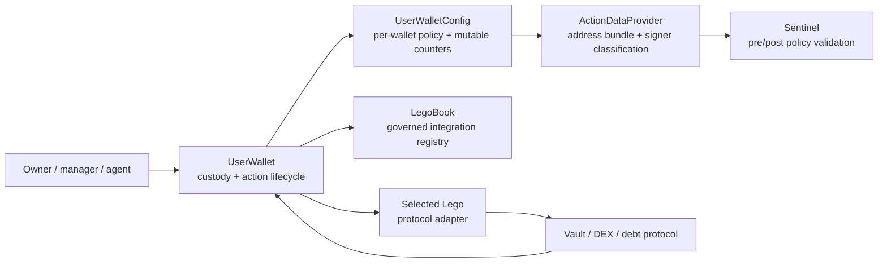
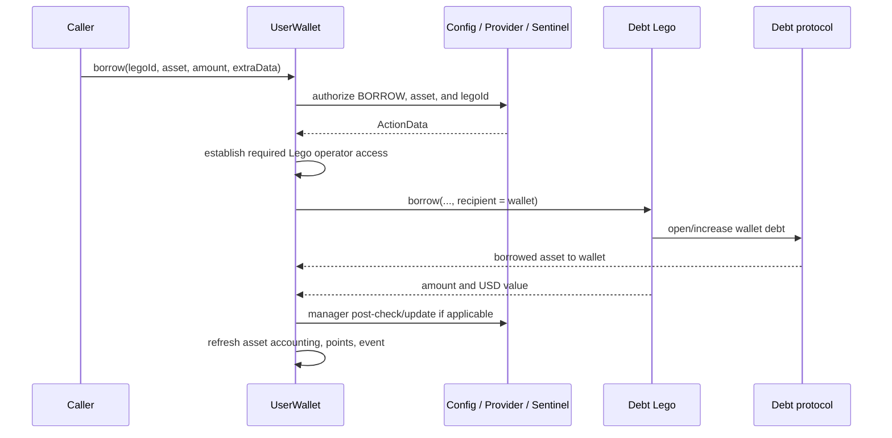
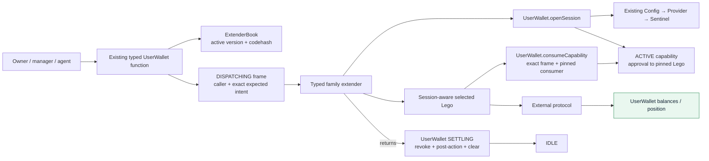

# Incremental User Wallet Extender Architecture — Codex Proposal

**Status:** **SUPERSEDED as an independent architecture plan**

**Authority notice:** On 2026-07-24, the owner selected
[`docs/wallets-v3/simplified-user-wallet-action-architecture-codex.md`](wallets-v3/simplified-user-wallet-action-architecture-codex.md)
as the governing architecture for this track. This file is preserved for
reasoning history and provenance. Where it conflicts with the governing
document, the governing document controls.

**Track:** Fresh alternative to the User Wallet v3 PoC; the PoC remains on hold

**Revision:** Reconciled with owner clarifications and cross-agent discussion
through 2026-07-24

**Implementation authorized:** No

**Migration design:** Explicitly out of scope

**Repository snapshot reviewed:** `wallets-v3` at `5b0a635`

**Primary baseline:** The existing `contracts/core/userWallet/UserWallet.vy`, `UserWalletConfig.vy`, `ActionDataProvider.vy`, `Sentinel.vy`, `LegoBook.vy`, and current Legos

**Owner clarification incorporated:** Routed Legos may be revised to authenticate
an active wallet session and pull from an explicit wallet address instead of
`msg.sender`; preserving unchanged Lego implementations is not a design goal.

## 1. Recommendation in one page

Do not transplant `UserWalletV3` into the existing system.

Use the current user wallet as the architectural trunk and add one narrow feature-extension seam behind its existing typed functions.

The recommended shape is:

1. Keep `UserWalletConfig`, Sentinel, manager permissions, payee/whitelist rules, freeze/ejection behavior, asset accounting, pricing, fees, points, and existing `ActionType` values.
2. Keep the user wallet as the only persistent custodian and the only contract that grants token approvals from wallet funds.
3. Keep the current public wallet functions—such as `depositForYield`, `withdrawFromYield`, `borrow`, and `repayDebt`—as the user-facing API.
4. Add a small global `ExtenderBook` whose address is immutable in the new wallet template. Do not put extender state or permissions into `UserWalletConfig`.
5. Route one family at a time from the existing typed wallet entry point to a versioned, codehash-pinned family extender.
6. Follow the PoC session sequence: the typed wallet facade records expected
   intent and enters `DISPATCHING`; the pinned extender calls `openSession`; the
   wallet authorizes and enters `ACTIVE`; the pinned Lego consumes the exact
   capability; and the wallet enters `SETTLING`, revokes authority, runs today's
   post-action work, clears the frame, and returns to `IDLE`.
7. Update routed Legos to the PoC-style session-aware interface: the extender
   calls the Lego, the Lego constructs and consumes the actual envelope, and
   only then pulls from the explicit wallet address rather than `msg.sender`.
   Do not add arbitrary target/calldata execution.
8. Start with only `depositForYield` through one revised session-aware yield Lego. Keep the public wallet API and existing Config/Sentinel policy inputs identical.
9. Treat wallet-callback compatibility as a fallback only for a particular Lego that cannot safely adopt the session-aware interface—not as a parallel architecture or the target design.
10. Expand to yield withdrawal and rebalance only after the selected spike demonstrates real isolation without unacceptable code-size, gas, or correctness cost.
11. Move debt in risk order: spend-like actions first, liability and asset-release actions later, and specialized deleverage last.

The intended end state is not the PoC with the old Config bolted onto it. It is the current production-oriented wallet with a typed, versioned family-coordination layer added around the parts that benefit from isolation.

### 1.1 Relationship to the PoC pattern

The internal routed-action architecture should deliberately reuse the PoC
state machine rather than inventing a second extender model:

| PoC pattern | Incremental existing-wallet application |
|---|---|
| Typed, codehash-pinned registered route | Existing typed wallet facade selects a reviewed ExtenderBook route that pins extender, Lego, action/effect, consumer mode, and codehashes |
| `IDLE → DISPATCHING` | Facade verifies `IDLE`, records real caller and exact expected intent, then calls the pinned extender |
| Extender calls `openSession(envelope)` | Same; wallet requires the pinned extender, exact facade/route match, and current Config/Sentinel authorization |
| `DISPATCHING → ACTIVE` | Same; wallet snapshots one capability and grants any exact temporary approval to the pinned Lego |
| Lego calls `consumeCapability(actualEnvelope)` | Same; revised Lego constructs actual fields, wallet requires the pinned consumer and exact semantic match |
| One capability consumption | Same; reuse, double consume, wrong action/effect/beneficiary, and nested dispatch fail |
| Wallet locks routed execution by transient phase | Same `IDLE / DISPATCHING / ACTIVE / SETTLING` lock; existing non-routed core paths retain their current guards and must not enter during a routed frame |
| Dispatcher closes after extender returns | Same implicit close: require opened/consumed state, enter `SETTLING`, revoke approval, enforce effect/postconditions, run existing post-action tasks, clear transient state, return to `IDLE` |
| `LEGO`, `CORE`, and `NONE` consumer modes | Preserve the vocabulary; production yield/debt use `LEGO`, named authority primitives may use `CORE`, and `NONE` remains test/measurement-only unless a real no-effect route is justified |
| `SPEND`, `LIABILITY`, `ASSET_RELEASE`, `AUTHORITY` effects | Preserve and map them action-by-action onto existing wallet actions and protocol-specific postconditions |
| Append-only succession and `DRAIN_ONLY` exits | Preserve before any extender version can open durable positions; use a compact global book first and add wallet-specific route state only if owner opt-in or personal version pinning is required |

The adaptations are outside that state machine:

- the existing public functions remain typed facades instead of making users
  call generic `execute(bytes)`;
- current Config/Sentinel remains the policy authority;
- current fees, yield realization, asset accounting, points, events, freeze,
  eject, and manager post-limits execute during open/settlement; and
- payment commitments remain out of the first scope.

There is intentionally no public `closeSession` call. As in the PoC, the wallet
closes and clears the session automatically after the extender returns. One
capability does **not** mean one protocol call: it means one authorized semantic
action and one consumption. Rebalance, deleverage, and other multi-step actions
may live in extenders when one composite envelope binds the complete plan and
one pinned composite Lego consumes once before performing all internal steps.
Avoid nested sessions; do not avoid legitimate multi-step execution inside the
single authorized action.

## 2. The most important finding

A direct extender call graph requires updated Legos—and that update is now an
accepted part of the design.

The tempting flow is:

```text
caller → UserWallet → YieldExtender → existing Yield Lego → protocol
```

But current Legos commonly pull assets from `msg.sender`. For example:

- Aave V3 yield deposit calls `transferFrom(msg.sender, self, amount)` in [`AaveV3.vy`](../contracts/legos/yield/AaveV3.vy#L494).
- Ripe yield deposit does the same in [`RipeLego.vy`](../contracts/legos/RipeLego.vy#L560).
- Ripe collateral, borrow, and repay additionally require `msg.sender == _recipient` in [`RipeLego.vy`](../contracts/legos/RipeLego.vy#L785), [`RipeLego.vy`](../contracts/legos/RipeLego.vy#L880), and [`RipeLego.vy`](../contracts/legos/RipeLego.vy#L920).

If an extender calls one of those Legos:

- the Lego sees the extender—not the wallet—as `msg.sender`;
- it looks for tokens or allowances belonging to the extender;
- Ripe's explicit caller/recipient checks fail; and
- making the extender temporarily hold funds would reverse one of the best PoC conclusions.

That constraint still matters because the fix must be explicit. There are only a
few honest choices:

1. Revise a routed Lego so it authenticates an active wallet session and pulls
   from the explicit wallet address.
2. Let extenders temporarily custody funds.
3. Add a generic wallet executor for extender-supplied calldata.
4. Keep the wallet as the actual Lego caller and let extenders coordinate only narrowly typed wallet primitives.

With Lego updates explicitly acceptable, the first option is preferred. It
actually removes action execution from the wallet, avoids a permanent
per-action callback surface, and makes future action shapes possible without a
new wallet callback.

The important custody invariant remains unchanged: the wallet approves the
pinned Lego, never the extender; the Lego pulls from the wallet only after
successfully consuming the exact active capability; and all outputs go directly
to the wallet.

This does not require revising every Lego before the architecture can be tested.
Start with one deposit integration, then update adapters family-by-family after
the seam passes its security, parity, bytecode, and gas gates.

## 3. What the current system already separates well

The existing wallet is large, but it is not one undifferentiated monolith.



### 3.1 Current responsibility map

| Component | Current responsibility | Incremental proposal |
|---|---|---|
| `UserWallet` | Custody, typed action entry points, temporary approvals, Lego calls, asset tracking, pricing/fees, events, pre/post orchestration | Keep as custody and lifecycle core; extract only family coordination |
| `UserWalletConfig` | Owner, managers, payees, whitelist, cheques, freeze/ejection flags, mutable counters, backpack pointers | Keep unchanged in the first extender slice |
| `ActionDataProvider` | Resolves system addresses and builds `ActionData`; calls Sentinel for pre-authorization | Keep unchanged in the first extender slice |
| `Sentinel` | Owner/manager permission decisions, action family permissions, allowed assets/Legos/payees, cooldown/count limits, post-action USD limits, payee and cheque checks | Keep unchanged |
| `WalletBackpack` | Governed lifecycle for shared support components | Keep; do not force extenders into per-wallet backpack fields |
| `LegoBook` | Registry of protocol-specific Legos | Keep authoritative for the selected Lego |
| Legos | Protocol-specific integration, token pulls, protocol calls, result normalization | Revise routed actions to authenticate/consume a wallet capability and pull from the explicit wallet |
| New `ExtenderBook` | Versioned family coordinators and lifecycle metadata | Add as a separate global component |
| New family extenders | Typed sequencing for yield, debt, and later families | Add one family/action at a time |

### 3.2 What the wallet currently owns

The wallet currently stores:

- its paired `walletConfig`;
- its asset inventory and per-asset accounting;
- the transient `checkedYield` flags;
- immutable WETH and native-asset identifiers.

See [`UserWallet.vy`](../contracts/core/userWallet/UserWallet.vy#L82).

The existing wallet does **not** store manager, payee, whitelist, or cheque policy. Those remain in `UserWalletConfig`.

The paired `walletConfig` pointer is set when the wallet is deployed and the current wallet exposes no replacement function. This proposal keeps that current relationship. It does not import the PoC's direct Config-replacement model.

### 3.3 What the current permission pipeline does

For a normal action, the wallet calls `_performPreActionTasks`:

1. `UserWallet` asks `UserWalletConfig.checkSignerPermissionsAndGetBundle`.
2. `UserWalletConfig` delegates the read-heavy bundle construction to `ActionDataProvider`.
3. `ActionDataProvider` resolves the wallet owner, manager status, system addresses, selected Lego, frozen/ejection state, and prior wallet value.
4. `ActionDataProvider` asks Sentinel whether the signer may perform the action.
5. The wallet enforces frozen/ejection restrictions.
6. For selected debt actions, the wallet may establish protocol-specific Lego access.
7. The wallet realizes yield on each touched asset before the action.

The source of that pipeline is [`UserWallet.vy`](../contracts/core/userWallet/UserWallet.vy#L978), [`UserWalletConfig.vy`](../contracts/core/userWallet/UserWalletConfig.vy#L400), and [`ActionDataProvider.vy`](../contracts/core/userWallet/ActionDataProvider.vy#L139).

After the action, `_performPostActionTasks`:

1. applies manager post-action USD and swap checks;
2. mutates manager period/lifetime counters through Config;
3. refreshes each touched wallet asset;
4. registers or deregisters assets as needed; and
5. updates deposit points.

See [`UserWallet.vy`](../contracts/core/userWallet/UserWallet.vy#L1019) and [`UserWalletConfig.vy`](../contracts/core/userWallet/UserWalletConfig.vy#L426).

This pre/post pipeline is not incidental overhead that an extender can casually replace. It is the current policy and accounting contract.

## 4. Existing flow of calls and funds

### 4.1 Current yield deposit

The current yield-deposit sequence is:

```mermaid
sequenceDiagram
    participant C as Caller
    participant W as UserWallet
    participant CFG as Config / Provider / Sentinel
    participant L as Yield Lego
    participant P as Vault protocol

    C->>W: depositForYield(legoId, asset, vault, amount, extraData)
    W->>CFG: authorize signer/action/assets/lego
    CFG-->>W: ActionData
    W->>W: realize prior yield; choose min(balance, amount)
    W->>L: approve exact deposit amount
    W->>L: depositForYield(..., recipient = wallet)
    L->>W: transferFrom(wallet, Lego, amount)
    L->>P: deposit/supply
    P-->>W: vault shares to wallet
    L-->>W: normalized result tuple
    W->>L: reset approval to zero
    W->>CFG: manager post-check/update if applicable
    W->>W: update asset data, points, event
```

The wallet-side implementation is [`UserWallet.vy`](../contracts/core/userWallet/UserWallet.vy#L227). The important fund property is that vault shares are delivered to the wallet, not to an intermediary.

### 4.2 Current yield withdrawal

The wallet:

1. authorizes either a normal caller or the special Config-driven payment path;
2. approves the selected Lego to pull vault tokens;
3. calls the Lego with the wallet as recipient;
4. resets the approval;
5. updates both the underlying asset and vault-token accounting.

The normal and special branches are in [`UserWallet.vy`](../contracts/core/userWallet/UserWallet.vy#L272). The special branch is used by `UserWalletConfig.preparePayment` in [`UserWalletConfig.vy`](../contracts/core/userWallet/UserWalletConfig.vy#L882).

That special path is a compatibility requirement. An extender design that handles only owner/manager entry points but breaks Config-initiated yield withdrawal is incomplete.

### 4.3 Current debt borrow

The current borrow sequence is:



There is no token allowance that can bound a liability. The current safety model trusts the selected Lego and its exact typed wallet call. The PoC improved this with semantic capabilities, but the current production system does not already have that mechanism.

### 4.4 Current debt repayment and collateral

- `addCollateral` and `repayDebt` are spend-like: the wallet grants temporary token authority to the selected Lego and clears it afterward.
- `removeCollateral` and `borrow` are non-spend effects: the important risk is the meaning of the protocol call, not an input-token allowance.
- `deleverage` is a specialized multi-asset Ripe path with subset checks, returned touched assets, and different event modes. It should not be treated as a trivial fifth debt function.

See [`UserWallet.vy`](../contracts/core/userWallet/UserWallet.vy#L530) through [`UserWallet.vy`](../contracts/core/userWallet/UserWallet.vy#L684).

## 5. What to retain from the PoC

The PoC's architecture and visual explainers contain valuable ideas, but they should be adapted rather than copied.

| PoC learning | Disposition here | Incremental interpretation |
|---|---|---|
| Wallet is the stable custodian and protocol identity | Keep | The current wallet continues to own tokens, vault shares, NFTs, and debt positions |
| Config/policy is separate from custody | Keep current system | Retain `UserWalletConfig`, ActionDataProvider, Sentinel, and current policy data |
| Features are typed extenders | Keep, narrower | Add family coordinators behind existing typed wallet entry points |
| No proxy, `delegatecall`, or arbitrary executor | Keep | No generic target/calldata execution and no delegatecall-based modules |
| Extenders hold no funds | Keep | Never approve or transfer user assets to an extender |
| One transaction has an explicit execution phase | Keep, simplify | Add a small transient extender frame only to extracted actions |
| Bind the original caller and exact action meaning | Keep | Hash all typed arguments, caller, action, selected Lego, wallet, chain, and extender version |
| Temporary authority is exact and cleared | Keep where existing integrations permit | Preserve exact approvals for deposit/repay; preserve and document legacy max-approval exceptions before redesigning them |
| Different effects need different bounds | Keep as a design taxonomy | Treat SPEND, LIABILITY, ASSET_RELEASE, and AUTHORITY separately; do not force them through one generic rule |
| Old versions retain exact exits | Keep before state-opening production use | Add an explicit active/drain-only lifecycle and keep old Lego IDs available for exits |
| Pin reviewed dependencies/codehashes | Keep | ExtenderBook records extender codehash; wallet verifies it on every dispatch |
| Direct wallet beneficiary | Keep | Protocol outputs continue to arrive at the wallet |
| Adversarial, mutation-sensitive tests | Keep | Malicious extender tests are required before adding the second action |

### 5.1 What not to bring over

Do not bring over, in the first incremental release:

- `UserWalletConfigV3`;
- the PoC's fixed-owner policy;
- direct Config replacement;
- the PoC's raw `execute(Bytes[1024])` selector router, where the extender alone
  translates opaque calldata into policy and capability meaning;
- per-wallet attachment storage before owner-specific opt-in or succession
  requirements justify it;
- Config authorization of a new generic `ActionEnvelope`;
- a generalized multi-capability, multi-consumer, or arbitrary-action engine;
- payment reservations, x402, MPP, or ERC-1271;
- generalized Lego callbacks;
- a claim that the PoC's direct-transfer gas savings apply to this hybrid.

This proposal **does** retain the PoC's narrow single-capability mechanism for
every routed action: one extender opens one facade- or caller-committed
envelope, one pinned `LEGO` or `CORE` consumer consumes it once, and the wallet
settles it. The rejected item above is the broader generalized framework, not
the open/consume/settle pattern.

The PoC measured an empty routed session at `117,497` tx-equivalent gas and a minimal routed yield deposit at `292,025`, versus a `123,126` direct control. Its own disposition was to redesign routed-session cost. See [`POC_RESULTS.md`](wallets-v3/POC_RESULTS.md#L171).

The incremental architecture should not knowingly reintroduce the whole measured framework around every existing action.

## 6. Why several obvious designs are poor fits

### 6.1 Full PoC transplant

This would replace the current Config/Sentinel policy, wallet ABI, accounting, owner/manager behavior, and operational tooling. It is the exact large bite this track is intended to avoid.

**Disposition:** Reject.

### 6.2 User calls the extender directly

If a user calls an extender and the extender calls the current wallet:

- the wallet sees the extender as `msg.sender`;
- the existing Config/Sentinel pipeline no longer sees the real signer;
- trusting the extender to report an arbitrary `originalCaller` creates a new authentication perimeter; and
- the existing typed wallet entry points still contain almost all the action logic.

**Disposition:** Reject for the first release.

### 6.3 Wallet calls extender; extender calls a session-aware Lego

This breaks current Lego caller assumptions if the Lego is unchanged, as
described in Section 2. Once the Lego is deliberately revised to authenticate
the active wallet capability and pull from the explicit wallet address, this is
the preferred path.

**Disposition:** Adopt one integration at a time behind the existing typed
wallet facade. Never route an unmodified `msg.sender`-funded Lego through an
extender.

### 6.4 Extender temporarily holds user funds

The wallet could approve the extender, the extender could pull funds, and then it could approve/call a current Lego as `msg.sender`. This would mechanically solve some yield calls.

It would also:

- make the extender an asset custodian during execution;
- add a second token hop and approval;
- expand loss and recovery conditions;
- still fail current Ripe caller/recipient assertions; and
- discard the PoC's clearest custody lesson.

**Disposition:** Reject.

### 6.5 Extender returns arbitrary calldata for the wallet to execute

A wallet could ask an extender for `(target, calldata)` and `raw_call` the selected Lego itself. That preserves the wallet as the Lego caller.

It also creates an executor whose safety depends on proving that target, selector, arguments, amount, beneficiary, and effect all match the authorized action. Reconstructing those checks becomes a disguised version of the PoC's semantic-capability framework.

**Disposition:** Reject as the initial seam. Reconsider only for a separately specified, action-specific call template—not a generic executor.

### 6.6 Read-only planner extenders

A static planner can normalize inputs or return a typed plan, after which the wallet performs the existing call.

This is relatively safe but does not remove much orchestration or create meaningful feature replacement. It may still be a useful fallback if a particular integration cannot support the session-aware interface.

**Disposition:** Keep as fallback, not primary recommendation.

## 7. Proposed architecture

### 7.1 High-level call graph



This deliberately preserves the PoC's router/session state machine. The typed
facade replaces opaque caller calldata only at the outer boundary; it does not
replace extender-opened sessions. The fund path still bypasses the extender:
the wallet approves the pinned Lego, the Lego pulls directly from the wallet,
and protocol outputs return directly to the wallet.

### 7.2 The new `ExtenderBook`

`ExtenderBook` should be a separate global registry, not new per-wallet policy.

Suggested record:

```text
familyId
version
extender
extenderCodehash
lego dependency binding (single address or bounded governed set)
legoCodehash(es)
lifecycle          ACTIVE | DRAIN_ONLY | DISABLED
supportedActions   bounded action mask/list
effectClass        SPEND | LIABILITY | ASSET_RELEASE | AUTHORITY
consumerMode       LEGO | CORE | NONE
exitActions        bounded action mask/list
```

Suggested families:

```text
YIELD
DEBT
SWAP
LIQUIDITY
REWARDS
```

Only YIELD should exist in the first spike.

Recommended rules:

1. One active version per family.
2. Versions increase monotonically.
3. Records are append-only.
4. Activating a successor moves the prior version to `DRAIN_ONLY`.
5. A drain-only version may be selected only through action-specific exit functions.
6. The wallet verifies the active extender and pinned dependency codehashes at
   dispatch, `openSession`, and privileged re-entry.
7. An extender may never choose its own family, version, or Lego.
8. Governance operations are timelocked and observable.
9. Extenders are reviewed immutable-code contracts, not upgradeable proxies; a proxy's codehash would not pin its implementation.
10. No registry entry grants arbitrary target/calldata authority.

### 7.3 Why not put extenders in `UserWalletConfig`

The Config should retain user policy, but it should not become the extension registry.

Reasons:

- the user is not choosing an extender when calling `depositForYield`; the system chooses the active reviewed family implementation;
- manager `allowedLegos` already controls which protocol adapters a manager may use;
- `ActionType` already controls whether a manager may manage yield or debt;
- adding extender addresses and lifecycle state would duplicate governance policy per wallet;
- every wallet Config would need synchronization when an extender succeeds another version; and
- `UserWalletConfig` is already extremely close to its deployment bytecode limit.

The repository's byte-budget document reports only hundreds of bytes of Config deployment headroom and explicitly treats the budget as exhausted. See [`user-wallet-config-byte-budget.md`](user-wallet-config-byte-budget.md#L1).

The new wallet template should instead receive `EXTENDER_BOOK` as an immutable constructor argument. Hatchery wiring changes, but Config storage and Sentinel semantics do not.

Extender activation is system-governed routing metadata, not a new user-level permission. All owner/manager action, asset, Lego, recipient, cap, freeze, and ejection permissions remain in the current per-wallet Config/Sentinel system.

### 7.4 Preserve the current public API

The preferred external surface remains:

```text
depositForYield(...)
withdrawFromYield(...)
rebalanceYieldPosition(...)
addCollateral(...)
removeCollateral(...)
borrow(...)
repayDebt(...)
deleverage(...)
```

The caller should not need to construct extender calldata or know an extender address.

Benefits:

- the wallet learns the caller's semantic intent before any extender-controlled
  code runs;
- the same caller-supplied action, assets, Lego IDs, and recipient reach the
  same Config/Sentinel policy rather than being reported by the extender;
- a malicious extender cannot substitute another still-policy-allowed amount,
  vault, asset, Lego, beneficiary, or action;
- SDK and product mental models remain stable;
- existing events, return values, freeze/eject branches, and operational
  monitoring can retain their action-specific meaning;
- identical ABI calls can be replayed against the reference and candidate
  wallets for differential parity testing;
- the wallet—not the caller—selects the system's active extender;
- no generic selector router is needed for the standard catalog.

An old-version exit should use a separate action-specific function or overload, for example:

```text
withdrawFromYieldWithExtenderVersion(version, ...)
repayDebtWithExtenderVersion(version, ...)
```

Do not add `executeAttached(id, bytes)` to the first spike. Later drain-only
exits may use a typed exit facade or the controlled generic dispatcher described
below.

### 7.4.1 What “typed facade records expected intent” means

A typed facade is the existing public wallet function reduced to a thin,
strongly typed boundary. It does not perform the protocol workflow. It captures
what the caller asked for before any extender-controlled code runs.

Illustrative deposit shape:

```text
depositForYield(legoId, asset, vault, amount, extraData):
    require phase == IDLE
    resolve and pin extender + Lego
    expectedIntent = hash(
        wallet,
        msg.sender,
        EARN_DEPOSIT,
        legoId + Lego address,
        asset,
        vault,
        amount,
        extraData,
        beneficiary = wallet
    )
    store transient DISPATCHING frame
    call YieldExtender.deposit(wallet, legoId, asset, vault, amount, extraData)
    require session opened and capability consumed
    settle using existing wallet accounting
```

The extender then constructs the PoC-style envelope and calls
`wallet.openSession(envelope)`. `openSession` recomputes its semantic identity
and requires it to equal `frame.expectedIntent` before running current
Config/Sentinel authorization or granting authority.

Therefore, if a malicious extender changes `amount`, substitutes another vault
or Lego, changes the beneficiary, or opens a different action, `openSession`
reverts. “Records expected intent” means records this transient commitment; it
does not mean the facade opens or pre-approves the session.

For a composite rebalance facade, the commitment can bind the whole action:

```text
EARN_REBALANCE
+ from Lego ID/address + source vault token + maximum shares
+ to Lego ID/address + target vault
+ minimum/maximum outcome constraints
+ extra data + wallet beneficiary
```

The extender must open that exact single action, and the pinned composite Lego
must consume an actual envelope with the same full-plan hash before executing
withdrawal and deposit steps.

### 7.4.2 Typed facades versus a future generic escape hatch

Typed facades should cover the existing, productized wallet catalog. They are
not intended to eliminate extender extensibility.

The clean internal model is one canonical `ActionIntent` with two possible
front doors:

```text
typed facade derives ActionIntent from firsthand typed arguments ─┐
                                                                  ├─ same registered extender dispatch
generic entry requires caller to supply ActionIntent explicitly ──┘
                                                                     → extender opens
                                                                     → consumer consumes
                                                                     → wallet settles
```

The facade and generic path must not create two session engines. They differ
only in how the wallet obtains the expected intent before entering
`DISPATCHING`.

Different kinds of future change have different needs:

| Future change | New wallet facade required? |
|---|---:|
| YieldExtender v2 changes implementation behind `depositForYield` | No |
| New Lego/integration selected by the existing `legoId` argument | No |
| New yield behavior expressible with the existing facade arguments | Usually no |
| Entirely new action shape or caller parameters | Yes, unless it uses the generic escape hatch |
| New permission family or effect class | Policy/core review still required even with an escape hatch |

After the first routed action proves the engine, reserve a controlled generic
entry point for future extenders. It may resemble the PoC's `execute(bytes)`,
but should improve caller-intent binding by accepting or deriving an explicit
expected envelope and policy context:

```text
executeExtender(
    registered route id,
    typed extender calldata,
    expected ActionEnvelope,
    existing-policy context: ActionType + assets + Lego IDs + recipient
)
```

The wallet would commit to the caller, route/version, selector, calldata
hash, complete expected envelope, and policy context before dispatch. The
pinned extender's `openSession` request must match that commitment exactly.
Before dispatch, the wallet must also require the caller-supplied policy
context, expected envelope, and registered route metadata to agree wherever
their fields overlap. The extender may not reinterpret those values.

This remains a generic **extender dispatcher**, not a generic wallet executor:

- the target must be a registered, codehash-pinned extender;
- the selector must be declared by the active or exact drain-only route;
- route metadata fixes the effect class and consumer mode;
- Config/Sentinel still authorizes the original caller and policy context;
- the capability still pins the Lego or named CORE primitive;
- no extender supplies an arbitrary wallet call target/calldata; and
- the ordinary open/consume/settle state machine is unchanged.

The tradeoff is ergonomics and auditability. A generic caller must construct
both typed extender calldata and the exact expected envelope/policy context,
whereas a facade derives those safely from normal function arguments. The escape
hatch should therefore be available for genuinely new functionality, not the
default UI/API for established actions.

This changes the generic-path trust boundary relative to the raw PoC entry:

- raw `execute(bytes)` makes the extender responsible for explaining what
  opaque caller bytes mean;
- committed generic dispatch makes the caller or SDK state both the requested
  call and its expected effect before the extender runs; and
- the wallet then enforces the expected effect at `openSession` and
  `consumeCapability`.

The committed form prevents extender substitution, but it cannot give opaque
generic calls the same human readability or encoding safety as a typed facade.
A faulty or compromised frontend could ask the user to submit an internally
consistent but unwanted generic request. Standard product actions should
therefore continue to use facades.

The no-migration benefit also has an exact boundary:

| Wallet/change | Can use it without replacing that wallet? |
|---|---:|
| Wallet template already has a facade; successor extender changes its implementation | Yes |
| Wallet template has the committed generic dispatcher; new action shape fits its frozen action/effect/consumer and policy vocabulary | Yes |
| New route requires only another registered extender/Lego and existing policy inputs | Yes |
| Wallet predates the generic dispatcher | No |
| New action needs a new effect class, consumer mode, named authority primitive, Config/Sentinel permission, or core settlement rule | Not necessarily; core/policy change may be required |

A global ExtenderBook can provide this future-route benefit without per-wallet
attachment storage: the existing wallet resolves a newly registered route
through its already-immutable book pointer. Per-wallet attachments are useful
only if owners must independently opt in, pin a personal version, or control
succession. Those are valid later requirements, but not prerequisites for the
generic dispatcher or the first spike.

### 7.5 The transient extension frame

Extracted actions should create a small transient frame before making any external call.

Suggested fields:

```text
phase
originalCaller
action
extender
extenderVersion
routeId / selector
legoId
lego
effectClass
consumerMode
expectedIntentHash
expectedEnvelopeHash
policyContextHash
extenderCalldataHash (generic path only)
capabilityConsumed
resultHash / typed result fields
```

Suggested phases:

```text
IDLE
DISPATCHING
ACTIVE
SETTLING
```

The frame's `expectedIntentHash` should commit to:

```text
domain separator
chain.id
wallet address
original caller
action
extender family and version
extender address
route ID and selector
legoId and resolved Lego address
every typed external argument
extender calldata hash for a generic request
special/normal action mode
complete expected capability envelope
existing-policy context
```

The extender proposes the same PoC-style `ActionEnvelope` during
`openSession`. The wallet requires every envelope field and semantic hash to
match the typed facade's expected intent, then applies the existing
Config/Sentinel policy using `frame.originalCaller`. This preserves the PoC
capability mechanism without replacing the existing Config data model.

### 7.6 Interaction with existing `@nonreentrant`

Do not casually remove the current Vyper `@nonreentrant` guard.

The first spike should test this exact structure:

1. the existing public action remains `@nonreentrant`;
2. it records the exact `DISPATCHING` frame before its first external call;
3. only the pinned extender may call frame-gated `openSession`, which runs
   current authorization, snapshots the capability, grants any exact Lego
   approval, and enters `ACTIVE`;
4. only the frame-gated `consumeCapability` entry omits the decorator so the
   pinned Lego can consume during the active call;
5. every existing top-level wallet action remains guarded; and
6. capability consumption checks phase, pinned Lego caller, action, intent,
   beneficiary, effect bounds, and consumed state.

The spike must prove in the pinned Vyper/Boa environment that:

- the intended Lego capability consumption succeeds;
- reentry into any normal top-level action fails;
- a token, Config, Lego, or extender callback cannot start another extension action;
- a second capability consumption fails; and
- all frame state rolls back on a downstream revert.

If Vyper's generated nonreentrant behavior does not compose cleanly with the
frame-gated consume entry, stop. Do not weaken global reentrancy protection to
make the architecture fit.

### 7.7 The session-aware Lego interface

The routed Lego interface must make the wallet and active session explicit.
Conceptually:

```text
depositForYieldFromWallet(wallet, exact action args, frame commitment)
withdrawFromYieldForWallet(wallet, exact action args, frame commitment)
addCollateralFromWallet(wallet, exact action args, frame commitment)
repayDebtFromWallet(wallet, exact action args, frame commitment)
```

Before calling the Lego, the extender constructs the expected envelope and
calls `wallet.openSession(envelope)`, exactly as in the PoC. The wallet accepts
that call only from the pinned extender during `DISPATCHING`, requires it to
match the facade-recorded intent and route metadata, runs current
Config/Sentinel authorization, snapshots the capability, grants any exact Lego
approval, and enters `ACTIVE`.

Each routed Lego action must:

1. accept the wallet address explicitly;
2. construct the actual action envelope from the arguments it is about to use;
3. call `wallet.consumeCapability(actualEnvelope)` before any token pull,
   authority use, or protocol effect;
4. rely on the wallet to require `msg.sender == frame.lego` and an exact
   semantic/effect match;
5. pull the authorized amount from the explicit wallet address—not
   `msg.sender`;
6. deliver every asset, vault token, borrowed asset, or released collateral
   directly to the wallet;
7. return typed results and touched assets for wallet settlement; and
8. retain no wallet funds or allowance.

Current Ripe assertions such as `msg.sender == _recipient` must become exact
active-session/capability checks. As in the PoC, the wallet authenticates the
Lego as the pinned capability consumer; the Lego cannot consume or use the
wallet allowance outside that active session. Simply replacing
`transferFrom(msg.sender, …)` with `transferFrom(_wallet, …)` without
capability consumption would let arbitrary callers target approved wallets and
is unacceptable.

The wallet clears the Lego allowance before successful settlement and verifies
the result against balances, allowance state, effect-specific postconditions,
and the consumed frame. It does not trust an economically meaningful value
supplied only by the extender.

### 7.8 Responsibility split

The extender owns:

- family-level sequence;
- execution and ordering of only the Lego operations already bound by the
  facade/generic request and registered route;
- composition of multi-step actions such as rebalance;
- family-version lifecycle and reviewed logic changes;
- future feature additions that fit the frozen capability/effect vocabulary.

The wallet retains:

- original signer and policy authorization;
- selected Lego resolution;
- custody and allowances;
- exact typed intent and active-session state;
- capability enforcement and settlement bounds;
- asset/accounting state;
- pricing, fee, and points integration;
- manager post-action mutation;
- events and user-facing return values;
- approval cleanup and effect-specific postconditions.

The session-aware Lego owns:

- protocol-specific argument validation and execution;
- construction of the actual envelope it consumes;
- the explicit `transferFrom(wallet, …)` where a spend is required; and
- direct delivery of outputs to the wallet.

This is still much less disruptive than the full PoC because Config, Sentinel,
the public action ABI, wallet custody/accounting, fees, freeze/eject behavior,
Hatchery identity, and the operational policy model remain intact.

### 7.9 Why the session-aware path is now preferred

The previous recommendation favored wallet callbacks only because unchanged
Legos require the wallet to remain their direct caller. The owner has clarified
that revising the Legos is acceptable. That removes the main reason to build a
permanent callback compatibility layer.

The preferred first spike is therefore one session-aware yield Lego:

- update only the selected deposit integration;
- keep the current typed wallet facade and Config/Sentinel call;
- have the facade lock the wallet in `DISPATCHING` and record exact expected
  intent before extender dispatch;
- have the pinned extender call `openSession` with the matching envelope;
- approve only the pinned Lego while the session is `ACTIVE`;
- have the Lego consume the exact capability before pulling;
- pull from the explicit wallet and return shares directly to it; and
- compile/profile the resulting wallet before converting the rest of yield.

Where deployed wallets or open positions give an existing Lego ID durable
meaning, deploy the session-aware version under a new ID. If the reviewed
environment has no compatibility requirement, the source/interface may be
updated directly; ID reuse is a deployment/governance decision, not an
architectural requirement.

Use a narrowly typed wallet callback only as an integration-specific fallback
if a protocol's Lego cannot be revised safely. Do not build and maintain both
execution seams by default.

### 7.10 Harden the existing authority-grant path before debt

The alternative proposal identifies a valuable issue that is separable from the
extender decision: `_setLegoAccessForAction` asks the selected Lego for a target,
an ABI signature string, and an input count, then constructs a `raw_call` from
that response.

This is not a caller-controlled arbitrary executor:

- Config/Sentinel selects the governed Lego;
- the Lego, not the end caller, supplies the target and ABI;
- the wallet supports only three fixed argument layouts;
- no ETH value or arbitrary payload is accepted; and
- failure reverts the action.

It is nevertheless a broad, stringly typed authority mechanism in the custody
contract. On this snapshot, the nonempty behaviors are finite:

- Ripe: `setUndyLegoAccess(address)`;
- Euler rewards: `toggleOperator(address,address)`.

Before routing debt, inventory these behaviors and prototype explicit,
protocol-specific authority primitives whose target, operator, argument layout,
grant condition, and revoke condition are independently pinned. Do not let an
extender or Lego supply arbitrary target/calldata to the primitive.

Treat this as a parallel hardening lane with its own parity and bytecode gate.
It may be worth doing even if the extender experiment is rejected. Conversely,
do not claim that replacing this path proves the rest of the session engine.

## 8. Proposed yield design

### 8.1 First spike: one session-aware deposit

The first implementation experiment should contain exactly:

- `ExtenderBook` with one immutable/governed YIELD v1 record;
- `YieldExtenderV1.deposit`;
- the existing `UserWallet.depositForYield` external signature;
- one transient extension frame and capability-consumption entry;
- one revised session-aware yield Lego;
- one malicious extender and adversarial Lego fixture; and
- differential tests against the current wallet.

No withdrawal, rebalance, debt, generic router, wallet-callback compatibility
layer, old-version exit, payment, or new Config API belongs in this spike.

### 8.2 Session-aware-Lego deposit flow

```mermaid
sequenceDiagram
    participant C as Caller
    participant W as UserWallet
    participant CFG as Existing Config / Sentinel
    participant B as ExtenderBook
    participant E as YieldExtenderV1
    participant L as Session-aware successor Lego
    participant T as ERC-20
    participant P as Vault protocol

    C->>W: depositForYield(existing args)
    W->>B: active YIELD extender record
    B-->>W: v1 address + codehash
    W->>W: bind expected intent; phase DISPATCHING
    W->>E: deposit(exact typed intent)
    E->>W: openSession(exact envelope)
    W->>CFG: existing pre-action authorization
    CFG-->>W: existing ActionData
    W->>W: match facade intent; approve pinned Lego; phase ACTIVE
    E->>L: depositFromWallet(wallet, exact typed intent)
    L->>W: consumeCapability(actual envelope)
    W-->>L: capability consumed once
    L->>T: transferFrom(wallet, Lego, exact amount)
    T-->>L: exact funds
    L->>P: deposit/supply
    P-->>W: shares directly to wallet
    L-->>E: typed result
    E-->>W: typed result
    W->>W: phase SETTLING; clear approval; verify balances/result
    W->>CFG: existing manager post-check if needed
    W->>W: existing asset updates, points, event; clear frame; phase IDLE
```

The wallet must approve the Lego, never the extender. The Lego must authenticate
the exact active wallet frame before pulling from the explicit wallet address.
The wallet must settle from independently checked balances and the
capability-consumed result, not from an untrusted extender assertion.

### 8.3 Withdrawal

Withdrawal can be the second action only after deposit passes.

It must preserve:

- the normal owner/manager permission path;
- the special Config-only `_isSpecialTx` path used by `preparePayment`;
- wallet ownership of the vault token before the action;
- underlying assets delivered directly to the wallet;
- any returned/refunded vault tokens delivered to the wallet;
- approval cleanup;
- both touched assets in post-accounting; and
- the current event and return tuple.

Current code sometimes grants `max_value(uint256)` approval for a vault-token withdrawal and then resets it. The first parity implementation should not silently alter that behavior. A later per-Lego approval-mode review may replace it with an exact amount where integrations permit.

### 8.4 Rebalance

Rebalance can be a single routed action even though it performs withdrawal and
deposit steps. The PoC invariant is one semantic capability consumption, not one
external call.

The cleanest PoC-style design is:

```text
typed rebalance facade binds the complete plan
→ YieldExtender opens one EARN_REBALANCE session
→ consumer = one pinned session-aware Rebalance Lego
→ Rebalance Lego consumes the composite envelope once
→ Lego withdraws from the source protocol
→ Lego deposits the intermediate asset into the target protocol
→ final vault tokens go directly to the wallet
→ wallet settles the one action
```

The composite envelope's `actionDataHash` must commit to both Lego/protocol
dependencies, source vault token, target vault, requested maximum, intermediate
asset constraints, minimum outcome constraints, extra data, and wallet
beneficiary. The wallet/Sentinel still authorizes both governed integration IDs
before activation.

The Rebalance Lego may implement both protocol steps itself or call narrower
internal protocol adapters. It may transiently hold the intermediate asset in
the same way existing Legos do, but the extender must never hold funds and the
Lego must finish with no unintended balance or authority.

An extender that directly calls two independently consuming Legos would require
a multi-consumer capability or two consumptions. That is possible but no longer
the PoC's simple one-consumer model. Prefer one composite Lego unless real
integration evidence justifies extending the engine.

Settlement must preserve yield realization, prevent insertion of a third
action, calculate one trusted maximum USD value, run post-accounting once,
verify all touched assets and residual balances/allowances, and retain the
current event/return semantics.

## 9. Proposed debt design

Debt should not move as one block.

### 9.1 Stage debt by effect

| Stage | Actions | Why |
|---|---|---|
| Debt A | `addCollateral`, `repayDebt` | Spend-like; temporary token authority provides a concrete bound |
| Debt B | `borrow`, `removeCollateral` | Liability/asset-release semantics require exact typed call binding and stronger postconditions |
| Debt C | `deleverage` | Specialized multi-asset Ripe flow with unique invariants |
| Debt D | Operator/access setup, if changed | Authority effect; should remain a named wallet primitive |

### 9.2 Add collateral and repay

The wallet frame binds:

- exact action;
- selected Lego ID/address;
- asset;
- maximum requested amount;
- extra data;
- wallet beneficiary/position owner.

The wallet approves only the pinned session-aware Lego. The extender never
receives the allowance. Before pulling from the explicit wallet, the Lego must
consume the exact spend capability.

Settlement should require:

- the expected capability was consumed once by the pinned Lego;
- the selected Lego's allowance is zero;
- wallet token loss does not exceed the framed amount, accounting for explicitly supported token behavior;
- returned values and touched assets match independent wallet/protocol
  observations, not merely an extender assertion; and
- current post-accounting runs once.

Where current integrations require a temporary maximum approval, preserve it during parity and treat its replacement as a separate adapter review.

### 9.3 Borrow

Borrow is not secured by an allowance.

The incremental design gets one meaningful protection from the typed facade plus
Lego consumption: the extender cannot change the action, selected Lego, asset,
amount, extra data, recipient, or wallet because the Lego's actual envelope
must exactly match the wallet's pre-bound frame.

Residual trust remains:

- the selected Lego may misbehave;
- the external protocol may create a different liability than its adapter reports;
- a simple increase in wallet token balance does not prove the debt amount is correct; and
- generic postconditions cannot replace protocol-specific debt inspection.

Therefore the borrow slice should require a real selected protocol and a protocol-specific postcondition plan. For Ripe, that may include reading the wallet's debt state before and after and proving the delta is bounded by the authorized amount. If that cannot be measured reliably, the design must explicitly retain the Lego/protocol as a trusted semantic boundary.

Do not claim that copying the PoC's words “LIABILITY capability” into an enum solves this. The enforcement mechanism matters.

### 9.4 Remove collateral

The typed facade, active frame, and session-aware Lego can ensure:

- the exact typed amount is presented to the selected Lego and consumed;
- the wallet is the beneficiary;
- the resulting asset reaches the wallet; and
- the extender cannot substitute another action.

It still needs protocol-specific validation that the selected call did not remove more collateral or alter a different position. Treat those as Lego/protocol trust unless independently checked.

### 9.5 Deleverage

Deleverage can also be one extender/session action. In fact, the current
`RipeDeleverageLego.deleverageForUserWallet` is already conceptually a composite
Lego: the wallet calls one adapter entry point and the adapter performs the
multi-step Ripe workflow.

The PoC-style routed version is:

```text
typed deleverage facade binds complete mode + asset plan
→ DebtExtender opens one REPAY_DEBT/deleverage session
→ pinned session-aware RipeDeleverageLego consumes once
→ Lego performs all internal deleverage steps
→ wallet settles the single semantic action
```

The current path distinguishes:

- specific assets versus automatic amount mode;
- mutually exclusive mode selection;
- a bounded list of requested assets;
- a returned subset of touched assets;
- nonzero repayment;
- different event operation codes.

The composite `actionDataHash` must bind the mode, every vault ID, asset and
target repayment amount, auto-deleverage amount, extra data, wallet beneficiary,
and allowed touched-asset set. Settlement must verify nonzero repayment, touched
assets are the expected subset, debt reduction/effect bounds are satisfied, and
no residual wallet authority remains.

It should still be staged after simpler debt actions because its differential
and protocol-specific invariant matrix is larger—not because extenders or
single-capability sessions cannot support it.

## 10. Extender and Lego lifecycle

### 10.1 Extender succession

Before an extender may open persistent positions, define:

- what makes a successor valid;
- which actions the old version may still perform;
- how a broken active version is disabled;
- whether an old exit can be invoked without the broken active version;
- how codehash mutation is handled; and
- how offchain clients discover active and drain-only versions.

The default lifecycle should be:

```text
PENDING → ACTIVE → DRAIN_ONLY → DISABLED
```

Transitions are one-way.

### 10.2 Lego identity is a separate lifecycle problem

An extender version and a Lego ID are not the same thing.

The current `LegoBook` can update the address behind a registry ID. For position-opening Legos, overwriting an ID may make the original adapter unavailable for exit or may silently change the code trusted by existing manager allowlists.

Recommended incremental governance rule:

> Once a Lego ID has been used to open or manage wallet-keyed state, do not replace that ID's address in place. Register a successor under a new ID and retain the old ID until every relevant position can exit.

This preserves the meaning of existing `allowedLegos` lists and gives the wallet an exact old adapter to use for drain-only actions.

If the protocol truly permits a successor Lego to manage all old positions safely, establish that per integration rather than assuming it globally.

## 11. Security model

### 11.1 Authority before and after

| Actor/component | Current authority | New authority in proposal |
|---|---|---|
| Owner/manager/agent | Current Config/Sentinel-defined actions | Unchanged |
| UserWalletConfig | Policy and mutable counters | Unchanged |
| Sentinel | Permission decisions | Unchanged |
| UserWallet | Custody, approvals, Lego calls, accounting | Custody, policy, exact frame, Lego approvals, capability enforcement, settlement/accounting |
| Lego | Trusted protocol adapter called by wallet | Session-aware adapter called by extender; may pull from the explicit wallet only after exact capability consumption |
| ExtenderBook governance | None | Selects reviewed family coordinator versions |
| Extender | None | May sequence only the exact framed session-aware Lego operations |

### 11.2 Intended malicious-extender containment

For a typed facade—or a future committed generic request—the intended result is
that a malicious extender is reduced to liveness failure rather than semantic
substitution. That statement depends on the wallet correctly enforcing the
registered route, complete expected envelope, pinned consumer, one-time
consumption, approval cleanup, and effect-specific settlement. It also does not
turn a malicious Lego or external protocol into a harmless component; those
remain separate trusted or protocol-specifically checked boundaries.

A malicious active extender should be able to:

- revert;
- consume the gas forwarded to it;
- refuse to invoke the Lego or complete the session; or
- return malformed data and make the transaction revert.

It should not be able to:

- receive wallet funds;
- receive an allowance;
- select a different Lego;
- select a different action;
- change an amount, asset, vault, protocol, recipient, or extra-data field;
- cause two capability consumptions;
- make a Lego consume outside an active frame;
- reenter another wallet action;
- forge a trusted result;
- preserve authority after the transaction; or
- make a drain-only version open a new position.

### 11.3 Existing risks deliberately retained

This architecture does not solve:

- malicious or buggy Legos;
- mutable external protocols;
- every token behavior;
- current Config/Sentinel complexity;
- current gas cost;
- all current max-approval compatibility exceptions;
- protocol-specific liability correctness;
- global governance compromise;
- immutable wallet-core defects; or
- migration/recovery for already deployed wallets.

Those are not hidden shortcomings. They are the price of taking a smaller architectural step.

## 12. Bytecode and gas constraints

### 12.1 Current size

A live compiler check on this snapshot measured the current code-size-optimized `UserWallet` runtime at:

```text
23,032 bytes
```

The EIP-170 runtime limit is `24,576`, leaving:

```text
1,544 bytes
```

That matches the existing gas-profiling report in [`codex-2026-07-11.md`](gas-profiling/codex-2026-07-11.md#L1191).

The new frame/router cannot simply be added alongside every current action body. The spike must delete or relocate enough yield orchestration to pay for the new boundary.

### 12.2 Config size

Do not add extender policy to `UserWalletConfig` without a separate extraction plan. Its deployment/blueprint budget is already treated as exhausted in [`user-wallet-config-byte-budget.md`](user-wallet-config-byte-budget.md#L44).

### 12.3 Gas posture

Expect the first extender path to cost more than the current direct wallet-to-Lego path because it adds:

- ExtenderBook lookup/codehash validation;
- one wallet-to-extender call;
- one extender-to-Lego call and one Lego-to-wallet capability-consumption call;
- frame hashing and transient state; and
- settlement checks.

The user has explicitly accepted that this track may not capture the PoC's gas savings. Even so, cost must be measured and decomposed.

Do not set a made-up production gas target before the spike.

For each candidate action, report:

```text
current path gross / net / tx-equivalent
candidate path gross / net / tx-equivalent
increment from ExtenderBook lookup
increment from frame creation
increment from extender call
increment from Lego capability consumption
increment from settlement
runtime bytecode delta
deployment/blueprint bytecode delta
```

The decision is whether the modularity and lifecycle benefit is worth the measured cost.

## 13. Incremental work plan

### Phase 0 — freeze the parity contract

No architecture code.

Produce:

- an exact inventory of current yield/debt functions;
- current ABI and semantic events;
- current return values and storage mutations;
- all Config/Sentinel branches used by each action;
- current approval behavior by Lego/action;
- every nonempty `getAccessForLego` authority template and its revoke semantics;
- explicit intended permission treatment for every current `ActionType`,
  including ETH/WETH conversions;
- an explicitly pinned Vyper optimizer and EVM target that supports the selected
  transient-state design;
- current runtime/deployment sizes; and
- baseline gas for the selected spike scenario.

This document is the architectural analysis, not the full parity manifest.

### Phase 1 — one session-aware yield-deposit spike

Implement only the components listed in Section 8.1 with one revised yield
Lego. Keep the existing typed `depositForYield` wallet entry point. Do not add a
generic `execute(bytes)` entry point, a wallet-callback compatibility layer, or
another action family.

Required gate:

- current Config, Sentinel, and ActionDataProvider semantics remain unchanged;
- current external `depositForYield` signature remains;
- the pinned extender opens the exact facade-bound session and the pinned Lego
  consumes the exact active capability before any pull or protocol effect;
- the Lego pulls from the explicit wallet address rather than `msg.sender`;
- successful balances, shares, asset data, manager data, points, events, and return values match the reference wallet;
- extender balance remains zero for every asset;
- extender allowance remains zero;
- Lego allowance is zero after success;
- every adversarial extender mutation fails;
- reentrancy behavior is no weaker;
- runtime remains deployable under EIP-170;
- gas and code-size deltas are reported honestly.

Stop if the session-aware mechanism is more complex than the boundary it creates
or requires weakening reentrancy, source-of-funds, beneficiary, caller, or
protocol-specific authorization checks. A typed wallet callback remains an
integration-specific fallback only after documenting why that Lego cannot be
revised safely.

### Phase 2 — complete simple yield actions

Add:

- normal withdrawal;
- special Config-initiated withdrawal.

Convert only the yield Legos required by the selected production scope. Do not
make unrelated adapter conversion a release prerequisite.

Keep rebalance in core **during this phase only**. This is release staging, not
an architectural judgment that rebalance cannot live in an extender. Do not add
debt during this phase.

### Phase 3 — debt spend actions

Prerequisites:

- the selected execution seam passed the simple-yield gate; and
- the relevant current `getAccessForLego` behavior is either replaced by an
  explicit reviewed authority primitive or documented as unnecessary for the
  selected action/Lego.

Add:

- `addCollateral`;
- `repayDebt`.

Require at least one real session-aware debt Lego, not only a permissive mock.

### Phase 4 — debt semantic actions

Add:

- `borrow`;
- `removeCollateral`.

Require protocol-specific postcondition analysis and explicit residual-trust statements.

### Phase 5 — specialized debt and lifecycle

Add only if justified:

- route rebalance under the single-consumption composite design in Section 8.4;
- deleverage;
- explicit drain-only exit functions;
- old-version Extender selection for exits;
- Lego successor rules and monitoring.

### Phase 6 — consider other families

Swaps, liquidity, mint/redeem, rewards, WETH/native conversion, payments, and general batching are separate decisions. Success on yield/debt does not automatically authorize them.

## 14. Verification plan

### 14.1 Differential parity

For the current reference wallet and candidate wallet, initialize equivalent state and compare:

- success versus revert;
- complete return tuples;
- emitted semantic events;
- wallet token and native balances;
- protocol/vault balances and positions;
- selected Lego balances;
- extender balances;
- all relevant allowances;
- `assetData`, `assets`, `indexOfAsset`, and `numAssets`;
- manager period/lifetime data;
- payee/cheque state where applicable;
- last total wallet value and deposit points;
- freeze/ejection behavior; and
- special Config-driven flows.

### 14.2 Signer matrix

At minimum:

- owner, not manager, `canOwnerManage = true`;
- owner, not manager, `canOwnerManage = false`;
- owner who is also a manager, both `canOwnerManage` branches;
- active manager;
- not-yet-active manager;
- expired manager;
- unregistered caller;
- Billing special caller where applicable;
- Config special caller where applicable;
- agent-mediated caller;
- locked signer;
- frozen wallet; and
- ejection mode.

Preserve the current distinction between pre-action owner bypass and post-action manager accounting.

### 14.3 Permission matrix

Cover:

- allowed/disallowed action family;
- allowed/disallowed assets;
- allowed/disallowed Lego IDs;
- approved/unapproved yield opportunity;
- per-transaction, per-period, and lifetime USD caps;
- exact equality at each cap;
- cooldown and transaction-count limits;
- zero-price behavior;
- period initialization and rollover; and
- full rollback after a post-action rejection.

### 14.4 Malicious extender matrix

Test an extender and collaborating/adversarial Lego that try to:

- call `openSession` without a facade-derived or generic committed
  `DISPATCHING` request;
- open from the wrong extender;
- open twice or return without opening;
- consume without wallet dispatch;
- consume before `ACTIVE` or after `SETTLING`;
- use the wrong action;
- use the wrong Lego ID or address;
- change one argument at a time;
- change the beneficiary;
- consume twice;
- return success without consumption;
- call steps out of order;
- reenter a normal wallet action;
- start a nested extender action;
- return false or malformed data;
- return a forged result;
- revert before capability consumption;
- revert after capability consumption;
- consume all forwarded gas;
- mutate code at the same address in the test environment; and
- use a drain-only version for a non-exit action.

### 14.5 Token and Lego matrix

Cover:

- standard exact-boolean ERC-20;
- no-return/false/malformed tokens according to current support;
- fee-on-transfer and rebasing behavior if claimed supported;
- current temporary maximum-approval integrations;
- at least one current `msg.sender`-funded yield path and its revised
  explicit-wallet counterpart;
- revised Ripe caller/recipient/session assertions;
- paused Lego;
- disabled or replaced Lego ID;
- Lego revert after token pull;
- protocol callback/reentrancy; and
- zero and maximum requested amounts.

### 14.6 Invariants

Core invariants:

```text
I1  UserWallet is the only persistent holder of user funds among wallet, extender, and coordinator.
I2  UserWallet remains the protocol position owner/beneficiary.
I3  Config/Sentinel makes exactly one pre-action decision per top-level action.
I4  Manager post-accounting runs exactly once after a successful top-level action.
I5  A framed capability can be consumed only once and only by the pinned Lego.
I6  Every consumed envelope field matches the top-level caller's exact facade-derived or explicitly supplied committed intent.
I7  Extender and Lego selection cannot be changed after authorization.
I8  No successful action leaves an unintended allowance.
I9  A revert after any external call restores frame, allowance, funds, Config counters, and wallet accounting.
I10 No drain-only extender opens or expands a position.
I11 A Config-initiated special withdrawal retains its current authority boundary.
I12 No generic arbitrary wallet target/calldata executor exists; any generic entry dispatches only to a registered extender and pre-commits its complete intent and policy context.
I13 Every routed success follows IDLE→DISPATCHING→ACTIVE→SETTLING→IDLE; every failure atomically rolls back to the pre-call state.
```

## 15. Concrete contract/file shape

Suggested new files for a future implementation:

```text
contracts/core/userWallet/extenders/ExtenderBook.vy
contracts/core/userWallet/extenders/YieldExtenderV1.vy
contracts/core/userWallet/extenders/DebtExtenderV1.vy
interfaces/UserWalletExtender.vyi
interfaces/ExtenderBook.vyi
interfaces/ExtenderStructs.vyi
interfaces/SessionAwareLego.vyi
tests/core/userWallet/extenders/
```

Expected modified files:

```text
contracts/core/userWallet/UserWallet.vy
interfaces/Wallet.vyi
contracts/core/Hatchery.vy
one selected yield Lego implementation (or a session-aware successor)
deployment configuration for the new template
```

Files that should remain behaviorally unchanged in the first spike:

```text
contracts/core/userWallet/UserWalletConfig.vy
contracts/core/userWallet/ActionDataProvider.vy
contracts/core/walletBackpack/Sentinel.vy
interfaces/WalletConfigStructs.vyi
unrelated production Legos
```

This is not a final file contract. It is a scope boundary for the first implementation proposal.

## 16. Decision table

| Decision | Recommendation | Reason |
|---|---|---|
| Keep current Config and Sentinel? | Yes | Preserves mature policy and avoids the largest PoC discontinuity |
| Put extender permissions in Config? | No | System-selected implementation is not user policy; Config byte budget is exhausted |
| Preserve typed wallet ABI? | Yes | Smaller product/integration change and easier differential testing |
| Add a generic extender escape hatch? | After the first spike | Use the same session engine; bind caller-supplied calldata, complete expected envelope, policy context, and a registered route; never allow arbitrary wallet targets/calldata |
| Add per-wallet attachment administration? | Not in the first spike | A global book already enables future registered routes; add wallet-specific state only if owner opt-in, personal version pinning, or wallet-controlled succession is required |
| Let extenders custody funds? | No | Expands trust and breaks a key PoC lesson |
| Change routed Legos? | Yes | Required for direct extender execution; start with one deposit Lego, then convert family-by-family |
| Add per-action transient frame? | Yes | Binds caller, complete intent, route, extender, Lego, effect, and one-time consumption |
| Keep current pre/post action pipeline? | Yes | It is the existing policy/accounting contract |
| Start with all yield actions? | No | Start with deposit only |
| Move debt immediately after deposit? | No | Complete the session-aware yield path first |
| Move all debt together? | No | Spend, liability/release, and deleverage have different risk models |
| Keep direct transfer untouched? | Yes | Extenders add no value to the direct transfer path |
| Require codehash pinning? | Yes | Prevent same-address extender mutation |
| Require drain-only lifecycle? | Before state-opening production use | Needed for safe succession and exits |
| Promise gas savings? | No | This design deliberately keeps existing policy and adds calls |

## 17. What success would mean

Success does **not** mean “the wallet now looks like the PoC.”

Success means:

- the existing user-wallet mental model still works;
- Config/Sentinel behavior still works;
- revised routed Legos work while unrelated/legacy paths remain intact;
- the wallet still owns all assets and positions;
- one family coordinator can be replaced without changing custody or policy;
- a wallet that already exposes committed generic dispatch can use a future
  route within its frozen capability and policy vocabulary without migrating;
- a malicious coordinator cannot turn its typed boundary into general wallet authority;
- the new boundary is small enough to understand and audit;
- the cost is measured and accepted; and
- adding the second action is a conscious decision based on the first action's evidence.

## 18. Final assessment

An extender-first direction is viable, but not as a direct copy of the PoC call graph.

The existing system's strongest incremental foundation is:

```text
current custody
+ current Config/Sentinel policy
+ existing typed wallet API
+ session-aware Legos converted one integration/family at a time
+ a small versioned family coordinator
+ exact wallet-held capability and settlement enforcement
```

The crucial design discipline is to separate **feature coordination** from **custody primitives**.

The extender may sequence the already-bound operations that implement the
authorized action. It may not change the plan, decide who the caller was, alter
which Lego policy approved, choose different funds, redirect the result, or
make the wallet execute arbitrary code.

That is a smaller bite than the PoC, preserves far more of the existing system, and still carries forward its best lessons: stable custody, typed replaceable features, no arbitrary execution, no extender custody, explicit transaction phases, exact intent binding, temporary authority, and controlled succession.

For every routed action, the high-level execution pattern remains uniform:

```text
facade-derived or explicitly supplied expected intent
→ registered extender opens
→ pinned consumer consumes once
→ wallet settles and closes
```

Typed facades are the primary, safest product surface. A later committed
generic dispatcher is the future-functionality escape hatch. It is not a
second execution architecture and it is not raw arbitrary wallet execution.

## 19. Cross-review of the alternative incremental-extenders proposal, Revision 2

### 19.1 Overall verdict

The [alternative proposal](wallets-v3/incremental-extenders-proposal-claude.md)
is materially useful. Its “custody core plus action catalog” framing is a good
way to reason about the long-term destination, and it found an authority-grant
hardening opportunity that this proposal had not emphasized enough.

Revision 2 is much stronger than the version initially reviewed. It now:

- preserves the existing typed wallet functions as intent-binding facades;
- explicitly recognizes that current Legos cannot be called through an
  extender unchanged;
- registers session-aware successor Legos under new LegoBook IDs;
- preserves the Config-initiated special yield-withdrawal path;
- stages debt by effect/risk; and
- adds a deposit-only development gate before its full Phase 1.

Those changes resolve the earlier call-graph blocker and make its direct
session-aware-Lego design a technically plausible candidate.

The subsequent cross-agent discussion resolves another earlier ambiguity. Both
proposals now agree that:

- typed facades record exact caller intent but do **not** open the session;
- every routed action uses the same
  `extender opens → consumer consumes → wallet settles` sequence;
- rebalance and deleverage may each be one composite extender action with one
  capability consumption; and
- a future generic extender path is valuable so a compatible deployed wallet
  is not stranded when a genuinely new action shape ships.

The remaining difference is the generic path's trust level. The alternative
keeps raw `execute(bytes)` as a deliberately PoC-grade escape hatch whose
semantic interpretation comes from the extender. This proposal recommends the
committed generic request in Section 7.4.2: the caller supplies the complete
expected envelope and current-policy context before dispatch, and the extender
must match them. If measurements show that stronger form is not viable, the raw
form would be a separate, weaker design requiring an explicit owner decision
and amendment to this proposal; it is not the current recommendation.

I would still not implement its full Phase 1 as written. Moving yield and debt
together, adding per-wallet attachments and a generic escape hatch, and
predicting code-size/gas outcomes all remain ahead of compiled evidence.

The right synthesis is:

```text
keep its long-term catalog-extraction thesis
+ keep the now-shared typed public wallet facade
+ keep one uniform PoC open/consume/settle state machine
+ use one revised session-aware Lego for the deposit spike
+ harden authority grants as an independent lane
- do not move yield and debt together on estimated byte math
- do not add raw generic execute(bytes) or per-wallet attachment administration yet
```

### 19.2 Ideas worth adopting

#### A. Treat bytecode displacement as a first-class architecture test

The alternative is right that the current wallet has too little EIP-170
headroom for an engine added purely on top. A real extender design must show
which current runtime bytes it removes in the same compiled template.

That sharpens this proposal's spike: measure not only behavior and gas but also
the final compiled runtime of the one-action session-aware candidate.
Source-line estimates are not enough because Vyper's optimizer, shared helpers,
ABI dispatch, and internal call graph make family contributions non-additive.

#### B. Replace stringly typed authority grants with explicit templates

The alternative's best security suggestion is to retire the Lego-supplied ABI
string mechanism in
[`_setLegoAccessForAction`](../contracts/core/userWallet/UserWallet.vy#L1361).
Section 7.10 incorporates that as a separate hardening lane.

The risk should be described precisely: this is not arbitrary end-user
execution, because a governed Lego supplies the target and signature and the
wallet fixes the argument layouts. It is still broader and harder to audit than
the two nonempty authority behaviors currently needed.

#### C. Pin the compiler/EVM target and measure the whole release shape

Transient state is part of the selected direct design. The alternative is right to
make the EVM target explicit rather than relying on the current template's
implicit compiler default. The selected target must be exercised in the same
Vyper/Boa environment used for parity, code-size, and gas evidence.

Its complete disposition table is also useful discipline. Every external
wallet function must be classified as staying, moving, or deliberately deferred
before any broad extraction phase.

#### D. Keep payments out of the first track

Deferring reservations/x402 is correct. Payments add persistent economic state,
liveness, replay, rail, and signature questions that do not help answer whether
yield/debt orchestration belongs in extenders.

#### E. Use typed facades and new Lego IDs

Revision 2's typed facade is the right caller-intent boundary: the wallet sees
the original arguments, computes and records the exact intent commitment, and
enters `DISPATCHING`. The pinned extender then opens the matching session, which
is where the wallet runs today's policy path.

Its successor-ID rule is also correct wherever a Lego ID already has deployed
meaning. A session-aware adapter should then receive a new LegoBook ID; the
legacy ID and behavior remain available for existing wallets and exits. Do not
mutate the meaning of an ID already present in manager allowlists or associated
with open positions. Direct source/interface revision remains possible only in
an environment where no compatibility or durable-position meaning exists.

### 19.3 Claims that need correction or stronger evidence

#### A. Session-aware Legos are a real adapter revision, not a one-line change

The initial alternative said all Legos stayed as they were, then drew:

```text
wallet → extender → existing Lego
```

and suggested adding one `consumeCapability` call per Lego action.

That was insufficient. Existing yield Legos commonly call
`transferFrom(msg.sender, ...)`, including
[`AaveV3.vy`](../contracts/legos/yield/AaveV3.vy#L494) and
[`RipeLego.vy`](../contracts/legos/RipeLego.vy#L560). If the extender calls the
Lego, `msg.sender` is the extender, even when the wallet approved the Lego.
Ripe debt actions also explicitly require
`msg.sender == _recipient` for collateral, borrow, and repayment paths in
[`RipeLego.vy`](../contracts/legos/RipeLego.vy#L785).

Revision 2 now correctly removes `CORE_CONSUMED` as a solution and requires
session-aware successor Legos that pull from an explicitly authenticated
wallet. An honest direct path must either:

1. change the selected Lego to authenticate an active wallet session and pull
   explicitly from the wallet; or
2. have the extender call a typed wallet callback so the wallet remains the
   Lego caller.

That correction makes the direct path viable. The owner has now explicitly
confirmed that revising the Legos is acceptable, so this document adopts that
path as the primary architecture rather than merely one candidate. Revision 2 has removed the stale
`CORE_CONSUMED` open question and corrected the executive summary; its comparison
table should likewise stop describing the Lego change as one small call. The
family's adapter surface, caller authentication, source-of-funds logic, and
protocol-specific caller asserts all require review.

Section 7.9 now makes that revised direct path primary. The compatibility
callback remains only a protocol-specific fallback.

#### B. The typed facade fixes intent binding; Config still is not a 1:1 envelope authorizer

Today's
[`checkSignerPermissionsAndGetBundle`](../contracts/core/userWallet/UserWalletConfig.vy#L402)
passes only signer, `ActionType`, asset list, Lego ID list, and transfer
recipient into the policy check. It does not authorize the exact amount, vault,
protocol target, beneficiary, effect class, `extraData`, or action-data hash.
The current typed wallet function supplies that missing semantic boundary.

The PoC Config, by contrast, authorizes the complete action envelope. Revision
2's typed facade largely resolves this for the standard catalog by having the
wallet compute and freeze exact intent before dispatch. The existing
Config/Sentinel remains the family/asset/Lego/recipient policy gate; it should
not be described as the full-envelope authorizer.

An opaque `execute(bytes)` escape hatch still cannot claim unchanged
Config/Sentinel semantics and PoC-equivalent exact intent authorization. Either:

- the typed wallet facade computes and freezes the exact intent before the
  extender call, as proposed here;
- Config/Sentinel gains new exact-envelope policy, contrary to the stated
  “unchanged” goal; or
- the reviewed extender remains trusted to preserve caller intent among
  otherwise permitted actions.

Revision 2 acknowledges the residual risk on the escape hatch. Its remaining
“maps 1:1” table language should be narrowed to “reuses the current pre-action
policy gate.” Section 7.4.2 selects a fourth, stronger generic-path
construction: require the caller to pre-commit both the extender calldata and
the complete expected envelope/policy context, then require exact agreement at
session open and consumption. That retains future-route extensibility without
making the extender the source of caller intent.

#### C. The action envelope is common, not identical

Pre-policy → Lego work → post-policy is a valuable shared skeleton. The action
bodies are not interchangeable catalog rows:

- special yield withdrawal is initiated by Config and has different pre-work;
- rebalance uses two Legos and takes the maximum of two USD values;
- add-collateral uses max approval behavior;
- debt actions invoke protocol authority setup;
- deleverage has two modes and validates touched-asset subsets;
- swaps and liquidity are multi-leg and have separate slippage/NFT semantics;
- yield post-processing treats underlying/vault tokens specially.

This variation is exactly why one action should validate the seam before a
generic engine or whole-family move is assumed.

#### D. “Yield and debt must move together” is not established

The alternative estimates a 4–6 KB engine, 2–2.5 KB yield removal, and 2.5–3 KB
debt removal, then concludes both families must move in Phase 1. Those estimates
are explicitly rough and were not produced by compiled variants.

Even if the final deployable template eventually needs a coordinated removal,
that does not require designing and validating eight actions simultaneously.
Architecture validation, adapter conversion, and release composition are three
different decisions.

The single session-aware deposit spike should first answer:

- what the direct seam costs in runtime bytes;
- whether a reusable engine actually amortizes;
- how much action code is truly displaced;
- whether the final runtime remains below 24,576 bytes; and
- whether the security boundary is simpler than today's typed action.

Only compiled evidence can tell us whether a later template release must bundle
more than one extracted action.

#### E. The +10–25k routed-gas estimate is not yet decision-grade

The direction is plausible: keeping Config/Sentinel means the PoC's transfer-gas
savings do not apply, and the empty PoC session is not an apples-to-apples
incremental delta. But the proposed engine does not make its own dispatch,
codehash checks, transient frame, capability hashes, calls, and settlement free.

The PoC measured
[`117,497`](wallets-v3/POC_RESULTS.md#L181) tx-equivalent gas for the empty
session and
[`292,025`](wallets-v3/POC_RESULTS.md#L183) for minimal routed yield versus a
`123,126` direct control. Those numbers do not predict the existing-wallet
candidate, but they do require measurement before calling the overhead low
single digits. Section 12.3 therefore retains a decomposed profile rather
than a forecast.

#### F. Sentinel should fail closed, but not through a blind two-line edit

The fallback in
[`Sentinel.vy`](../contracts/core/walletBackpack/Sentinel.vy#L188) returns true
for action values not handled by its permission families. That becomes more
dangerous if registry route metadata can introduce the action value.

However, current ETH→WETH and WETH→ETH manager actions also reach that fallback.
A safe hardening change must first specify their intended manager permission,
explicitly handle every valid singleton `ActionType`, reject zero/composite or
unsupported values, and add mutation tests. It should be reviewed independently
from the extender architecture rather than hidden inside Phase 1.

#### G. Per-wallet attachments are optional, not a starting requirement

Codehash pinning, append-only versions, and drain-only exits are valuable. They
do not automatically require every wallet to store and administer its own route
table. If extender choice is system-governed rather than user policy, a global
append-only ExtenderBook can retain old exit versions while the wallet holds
only a compact immutable registry pointer.

Per-wallet attachment state may later be justified by opt-in behavior or
wallet-specific succession. Starting there adds setter authority, storage,
Hatchery work, selector administration, and core bytecode before the extension
seam itself has proven useful. A global book plus a generic dispatcher can
still make later registered routes available to wallets that already implement
that dispatcher. It does not provide owner-specific opt-in or personal version
pinning; those are the concrete requirements that would justify attachments.

### 19.4 New ideas incorporated into the forward path

The cross-review and follow-up discussion change this proposal in six concrete
ways:

1. **Session-aware deposit spike.** Test one revised Lego against the same typed
   wallet API, Config/Sentinel inputs, initialized state, and adversarial
   reference behavior. Keep wallet callbacks as a per-integration fallback.
2. **Authority hardening lane.** Inventory and replace the finite current
   authority templates independently of the extender result.
3. **ActionType exhaustiveness lane.** Specify conversion permissions and make
   unsupported action flags fail closed before route metadata can depend on
   them.
4. **Compile-first release composition.** Do not decide whether one or several
   actions must move in a template until real compiled bytecode establishes the
   minimum deployable bundle.
5. **Uniform composite actions.** Rebalance and deleverage remain staged, but
   each may be one extender-opened, composite-Lego-consumed semantic action;
   one consumption never means only one external protocol call.
6. **Two safe entry modes, one engine.** Typed facades derive canonical intent
   for established actions. A later committed generic dispatcher accepts that
   same intent explicitly for new shapes within the existing capability and
   policy vocabulary.

This preserves the alternative proposal's strongest strategic insight—extract
the action catalog over time—without accepting its largest unproven jump.
